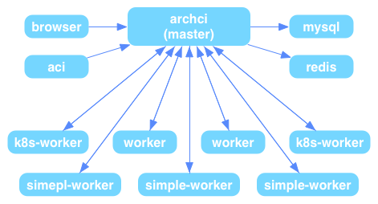

### 系统架构

---

### 架构图

ArchCI符合master/slave结构，浏览器发送HTTP请求给archci，archci处理请求并将测试任务下发给底层的worker。

### 系统组件

[archci](https://github.com/ArchCI/archci)是整个项目的API服务器和前端展示页面，负责接受客户端的请求，并且收集worker的测试报告，最终展示给用户。

[worker](https://github.com/ArchCI/simple-worker)是真正负责执行测试的组件，他会调用底层的docker容器执行测试脚本，最后将结果返回给archci服务器，如果测试项目过多可以通过多运行几个worker来分摊压力。

目前ArchCI服务还依赖MySQL与redis存放测试数据，因此最基础的ArchCI服务需要启动这四个进程。

