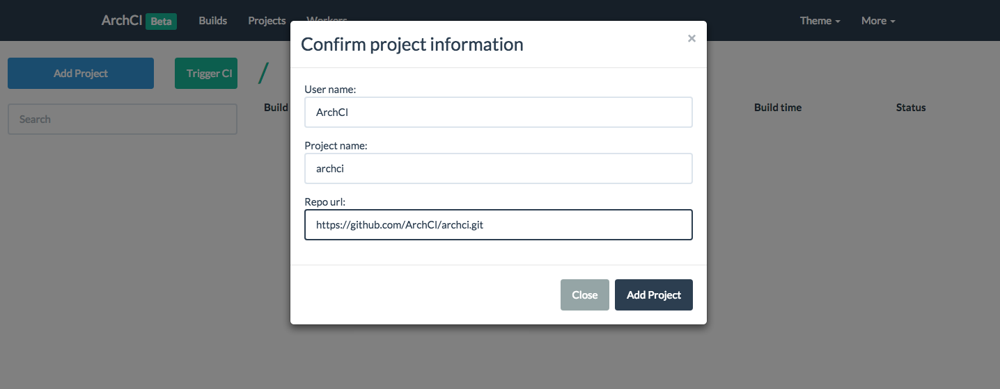

### 项目简介

---

### 背景介绍

持续集成，是IT企业为保障项目质量所实施的项目管理流程。任何项目一旦有代码的提交，都必须经过自动化的单元测试与集成测试，保证项目稳定与可靠，目前流行的持续集成系统包括Jenkins。

ArchCI是开源的持续集成框架，它基于轻量级的Docker容器，并且代码是Golang实现，能轻易部署到Linux、Mac OS、Windows等操作系统上。作为新型持续集成系统，ArchCI架构上支持水平拓展，并且已经集成Github、Gitlab的API，在不愿意折腾Jenkins的情况下非常适合中小型团队的项目持续集成。

### 部署服务

ArchCI提供了Docker镜像，你可以通过以下命令启动服务。

```
docker run -d -e MYSQL_ROOT_PASSWORD=root -p 3306:3306 mysql:5.7
docker run -d -p 6379:6379 redis
docker run -d --net=host archci/archci
docker run -d --net=host --privileged archci/simple-worker
```

你也可以下载[archci](https://github.com/ArchCI/archci)与[simple-worker](https://github.com/ArchCI/simple-worker)的源码进行编译，或者下载我们编译好的二进制文件直接运行。

在本地访问Web服务器<http://127.0.0.1:10010>，通过界面添加持续集成的项目，当项目有所变更时就会触发ArchCI进行持续测试。


